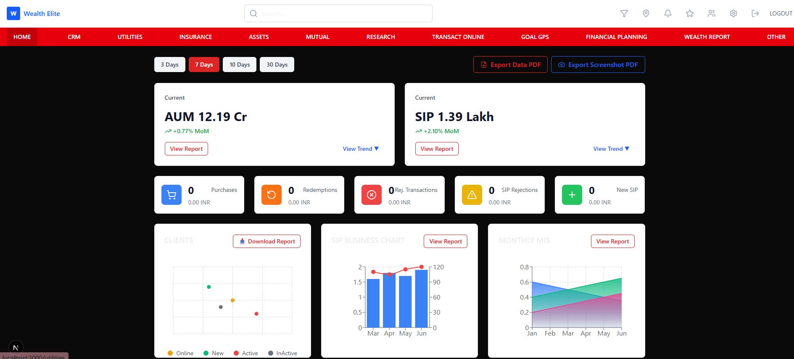

# Financial Dashboard

A comprehensive financial dashboard built with Next.js, featuring real-time financial metrics, interactive charts, and responsive design for wealth management.

## Features

- **Real-time Financial Metrics**: Display AUM (Assets Under Management) and SIP (Systematic Investment Plan) data with month-over-month changes
- **Interactive Charts**:
  - Clients bubble chart showing distribution by status
  - SIP business chart with combined bar and line visualization
  - Monthly MIS multi-line chart with area fills
- **Time Range Filtering**: Filter data by 3, 7, 10, or 30 days
- **Transaction Statistics**: Track purchases, redemptions, rejections, and new SIPs
- **Responsive Design**: Optimized for mobile, tablet, and desktop devices
- **Loading States**: Skeleton loaders and smooth transitions
- **Error Handling**: Comprehensive error boundaries and retry mechanisms

## Tech Stack

- **Framework**: Next.js 14+ with App Router
- **Language**: TypeScript
- **Styling**: Tailwind CSS
- **Charts**: Recharts
- **Icons**: Lucide React
- **State Management**: React Hooks

## Project Structure

```
src/
├── app/                    # Next.js App Router pages
│   ├── api/               # API routes for mock data
│   ├── layout.tsx         # Root layout
│   ├── page.tsx          # Dashboard home page
│   └── globals.css       # Global styles
├── components/
│   ├── ui/               # Reusable UI components
│   ├── charts/           # Chart components
│   ├── dashboard/        # Dashboard-specific components
│   └── layout/           # Layout components
├── hooks/                # Custom React hooks
├── lib/                  # Utility functions and constants
├── types/                # TypeScript type definitions
└── data/mock/            # Mock JSON data files
```

## Screenshots





## Getting Started

### Prerequisites

- Node.js 18+
- npm or yarn

### Installation

1. Clone the repository:

```bash
git clone <repository-url>
cd financial-dashboard
```

2. Install dependencies:

```bash
npm install
# or
yarn install
```

3. Run the development server:

```bash
npm run dev
# or
yarn dev
```

4. Open [http://localhost:3000](http://localhost:3000) in your browser.

## API Endpoints

The dashboard uses mock API endpoints:

- `/api/aum` - AUM data
- `/api/sip` - SIP data
- `/api/transactions` - Transaction statistics
- `/api/clients` - Client distribution data
- `/api/sip-business` - SIP business chart data
- `/api/mis` - Monthly MIS data

## Key Components

### MetricCard

Displays key financial metrics with trend indicators and action buttons.

### StatCard

Shows transaction statistics with icons and formatted values.

### Charts

- **ClientsBubbleChart**: Interactive bubble chart for client distribution
- **SipBusinessChart**: Combined bar and line chart for SIP business data
- **MonthlyMisChart**: Multi-line area chart for MIS trends

### TimeRangeFilter

Allows users to filter data by different time periods.

## Responsive Design

The dashboard is built with a mobile-first approach:

- **Mobile (320px-768px)**: Single column layout, collapsible navigation
- **Tablet (768px-1024px)**: Two-column grid, horizontal navigation
- **Desktop (1024px+)**: Full grid layout with optimal spacing

## Customization

### Adding New Charts

1. Create a new component in `src/components/charts/`
2. Add corresponding data types in `src/types/`
3. Create API endpoint in `src/app/api/`
4. Integrate into the main dashboard

### Styling

- Modify `src/app/globals.css` for global styles
- Update `src/lib/constants.ts` for colors and configuration
- Use Tailwind classes for component-specific styling

## Build and Deployment

```bash
# Build for production
npm run build

# Start production server
npm start

# Run linting
npm run lint
```

## Performance Optimizations

- Code splitting for chart libraries
- Lazy loading of components
- Optimized API calls with caching
- Responsive image loading
- Efficient re-rendering with React.memo

## Browser Support

- Chrome 90+
- Firefox 88+
- Safari 14+
- Edge 90+
